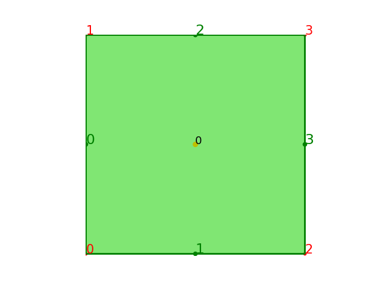
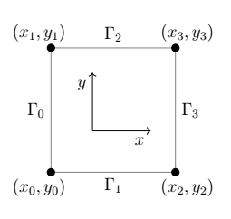

---
title:	Generalized Multiscale Finite Element Method to Solve Diffusion Equation
---

# Introduction

​	Different to the multiscale finite element method(MsFEM), 
generalized multiscale finite element method(GMsFEM) 
can have more than one basis in each coarse node. 

# PDE Model

  In this document, like the MsFEM, we still use a 2D problem to 
illustrate the basic ideas of the method. 
1D and 3D also be concerned. The 2D problem is:

$$
\begin{cases}
\begin{aligned}
L_{\epsilon}u =
-\nabla \cdot 
\left(
\kappa
(\frac{\boldsymbol{x}}{\epsilon})
\nabla u
\right)
&= f \quad in \quad \Omega \\
\quad u &= g \quad on\ \ \partial\Omega
\end{aligned}
\end{cases}
$$

# Calculation

The computation step is

- Variation
- Discretization
- Space
- Assemble
- Boundary condition
- Solve

  The only different thing is still how to construct multiscale space.
	
## 2 Discretization

  For GMsFEM, we need coarse mesh and fine mesh. Coarse mesh is used to 
approximate the numerical solution, while fine mesh used to construct 
the MsFEM basis. Let's give some notation to illustrate this method better.

| Notation |           Meaning            |
| :----:   | :----------------------------- |
|  NXC     | Number of segments in the x direction for coarse mesh|
|  NYC     | Number of segments in the y direction for coarse mesh|
|  NCC     |       Number of elements in coarse mesh       |
|  NNC     |       Number of nodes in coarse mesh       |
| LDC      | Number of local basis functions of cell in coarse mesh |
|  NXF     |  Number of segments in the x direction for fine mesh |
|  NYF     |  Number of segments in the y direction for fine mesh |
|  NCF     |       Number of elements in fine mesh       |
|  NNF     |       Number of nodes in fine mesh       |
| LDF 	   | Number of local basis functions of cell in fine mesh |
| DNC | Number of coarse cell in the support of one multiscale basis |
| DNN | Number of fine node in the support of one multiscale basis |
| $\mathcal{T}_H$ | coarse mesh |
| $K_H$ | element in coarse mesh|
| $\mathcal{T}_h$ | fine mesh in a coarse element |
| $K_h$ | element in fine mesh |

  Note that the mesh is not restricted to rectangular elements, 
we can use triangle, tetrahedron, hexahedron either. 
We gave the local degree of freedom number, the edge of the serial number.

## 3 Space

  In constructing the GMsFEM basis, divides it into two stages: 
offline and online.

1. Offline computation:
   - 1.1 Coarse grid generation;
   - 1.2 Construction of snapshot space;
   - 1.3 Performing dimension reduction of the snapshot space.
2. Online computation:
   - 2.1 Performing dimension reduction of the offline space;
   - 2.2 Times the partition unity;
   - 2.3 Iterative solvers, if needed.

  As for the actual computation, we need to compute 
partition unity $\chi$, snapshot basis function $\psi^{snap}$, 
offline basis function $\psi^{off}$, 
online basis function $\psi^{on}$ if needed.

### 3.1 Partition Unity

  We can take the original MsFEM as partition unity, the computation of 
MsFEM basis already examplified in this folder. Using $\chi$ as the partition unity notation, 
to different with the multiscale basis.

### 3.2 Offline computation

Before we get started, we have to point out that offline computation is 
focus on the $D_i$, where the subscript $i$ means the $ith$ coarse node,
i.e. $ith$ multiscale basis support. So we discuss in a support.

#### 3.2.1 Snapshot Space

  First, we using the same grid to compute the snapshot space $V^{snap}$,
when compute the partition unity. 
There are two options to construct the snapshot space. 
The first choice is to solve a set of local problems with 
boundary conditions in each coarse neighborhood.
The second choice is to use fine-grid nodal bases 
in each coarse region $D_i$.

  Assume the basis in the snapshot space, 

$$
\psi_{j}^{D_i}
$$

  In here, we use $P_{K_{H,i}}^{snap}$ to denote the $ith$ coarse cell's multiscale basis value 
in each fine node. We talk the multiscale basis for one support,
so abbreviate the subscript $K_{H,i}$ is a convenient choice.

**Choice 1**

   We can consider the following system as snapshot basis:

$$
\begin{cases}
\begin{aligned}
- \mathrm{div}
\left(
 \kappa \nabla \psi_j^{(i)}
\right)
&= 0,  & \text{in} D_i, \\
\psi_j^{(i)} &= \delta_j^h,
& \text{on} \partial D_i
\end{aligned}
\end{cases}
$$

  where $\psi_j^{(i)}$ means the $jth$ snapshot basis in the $ith$ support.
By solving the above system, we can get the $\psi_j^{(i)}$ basis value in each fine node.
You can set the number of snapshot basis, called $l_0=\dim(V^{snap}).$
And uniformly, use $P^{snap}$ denote the snapshot basis value in the every fine node.

  Then, we can get 

$$
P^{snap} = 
\begin{bmatrix}
\psi_0 \\ \psi_1 \\ \vdots \\ \psi_{l_0-1}
\end{bmatrix}
$$

The shape of the $P^{snap}$ is `(l_0, DNN)`.

**Choice 2**

  In this case, $P^{snap}$ is very simple.  

$$
P^{snap} = I
$$

The shape of the identity matirx is `(DNN, DNN)`.

#### 3.2.2 Offline Space

  Then, we need a spectral decomposition to reduce the dimension
of snapshot space. For example:
$$
\int_{D_i} \kappa \nabla \phi_j^{(i)} \cdot \nabla v = 
\lambda_j^{(i)} \int_{D_i} \hat{\kappa} \phi_j^{(i)} v,
\quad \forall v \in V_{snap}^{(i)}, \quad j=1,\cdots,l_0
$$

  where $\hat{\kappa} \coloneqq \kappa \sum_{i=1}^{N_{in}} H^2 |\nabla \chi_i|^2$ 
and $\{\chi_i\}_{i=1}^{N_{in}}$ is a set of partition of unity that already solved before.

  The space $V_{D_i}^{off}$ is constructed by selecting $l_1$ eigenvectors 
corresponding to smallest eigenvalues. By solving the spectral problem, 
the basis $\psi^{off}$ can be a linear combination of $\psi^{snap}$. 
We can get 
