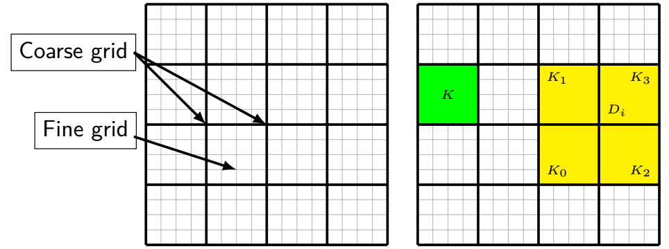
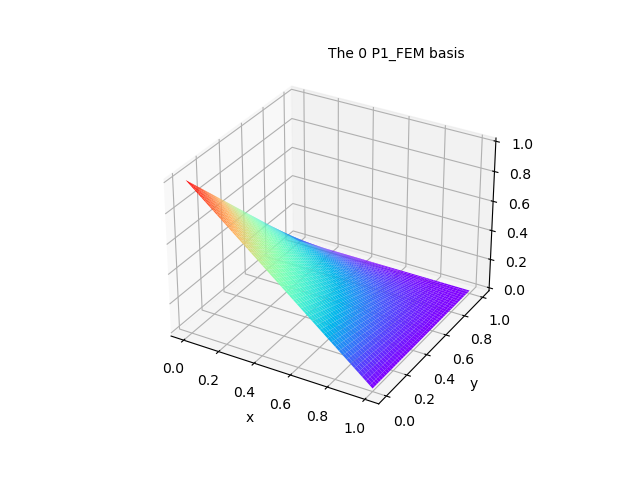
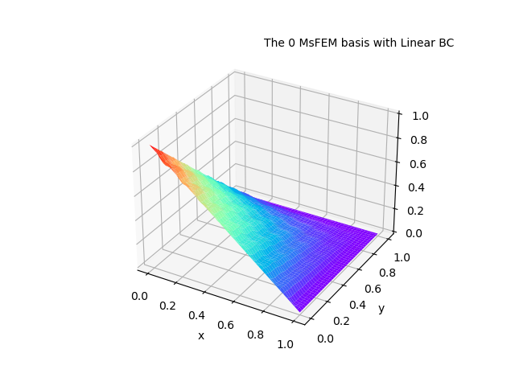

> A Multiscale Finite Element Method for Elliptic Problems in Composite Materials 
> and Porous Media, Journal of  Vol 134, 169-189.

# Introduction
​	In this document, we will use a 2D problem to illustrate the basic ideas of
 the method. 1D and 3D also be concerned. The 2D problem is:

$$
\begin{cases}
\begin{aligned}
L_{\epsilon}u =
-\nabla \cdot 
\left(
\kappa
(\frac{\boldsymbol{x}}{\epsilon})
\nabla u
\right)
&= f \quad in \quad \Omega \\
\quad u &= g \quad on\ \ \partial\Omega
\end{aligned}
\end{cases}
$$

​	When we need to solve a heterogeneity problem by Finite Element Method on a fine 
scale, probability, we get a very large algebraic equations system. For example, 
if we assume the area that we need to solve is $[0, 1] \times [0, 1]$, and using 
$1024 \times 1024$ rectangle to divide that area. In that case, we store it in a 
csr matrix form, the memory is 

$$
2^3 \times 2^2 \times 2^2
\times 2^{10} \times 2^{10} Byte
= 2^{27} Byte
= 2^7 MB.
$$

​	Although it's not too big for today's computers, but you should note that it's 
just a csr matrix and not too big a partition in engineering practice. If we want to
 compute it at the same time, or other complicated operations,  
 it will take a long time.

​	To reduce the matrix size, they put forward a generalized fem with a new name, 
multiscale finite element method. 

# PDE model

Follow the previous example, 

$$
\begin{cases}
\begin{aligned}
L_{\epsilon}u =
-\nabla \cdot 
\left(
\kappa
(\frac{\boldsymbol{x}}{\epsilon})
\nabla u
\right)
&= f \quad in \quad \Omega \\
\quad u &= g \quad on\ \ \partial\Omega
\end{aligned}
\end{cases}
$$

where $\Omega = [0, 1] \times [0, 1].$

# Calculation

The computation step is

- Variation
- Discretization
- Space
- Assemble
- Boundary condition
- Solve

	The computation step is same as the FEM, the only different thing is space.

## 1 Variation

Like the linear FEM, given a subspace of $H^1(\Omega),$  named $V_H.$ Then

$$
-\int_{\Omega}
\left(
\nabla \cdot 
\left(
\kappa(\frac{\boldsymbol{x}}{\epsilon})
\nabla u 
\right) 
\right) 
\cdot v ~\mathrm{d} \boldsymbol{x} = 
\int_{\Omega} f \cdot v 
~\mathrm{d} \boldsymbol{x}, 
\quad \forall v \in V_{H,0},
$$

where $V_{H,0} = V_H \cap H_0^1.$  Using green formulation, 

$$
\int_{\Omega} 
\kappa(\frac{\boldsymbol{x}}{\epsilon}) 
\nabla u \cdot \nabla v
~\mathrm{d} \boldsymbol{x} = 
\int_{\Omega} f \cdot v
~\mathrm{d} \boldsymbol{x}
$$

​	We will talk about the space $V_H,$ which composed by multiscale finite element basis, at subsection 4.

## 2 Discretization

​	For MsFEM, we need coarse mesh and fine mesh. 
Coarse mesh is used to approximate the numerical solution,
 while fine mesh used to construct the MsFEM basis. 

$K$ is a coarse cell, $D_i$ is the support of multiscale basis function. 
 Let's give some notation to illustrate this method better.

| Notation |           Meaning            |
| :----:   | :----------------------------- |
|  NXC     | Number of segments in the x direction for coarse mesh|
|  NYC     | Number of segments in the y direction for coarse mesh|
|  NCC     |       Number of elements in coarse mesh       |
|  NNC     |       Number of nodes in coarse mesh       |
|  LDC     | Number of local basis functions of cell in coarse mesh |
|  NXF     |  Number of segments in the x direction for fine mesh |
|  NYF     |  Number of segments in the y direction for fine mesh |
|  NCF     |       Number of elements in fine mesh       |
|  NNF     |       Number of nodes in fine mesh       |
|  LDF     | Number of local basis functions of cell in fine mesh |
| $\mathcal{T}_H$ | coarse mesh |
| $K_H$ | element in coarse mesh|
| $\mathcal{T}_h$ | fine mesh in a coarse element |
| $K_h$ | element in fine mesh |

​	Note that the mesh is not restricted to rectangular elements, 
we can use triangle, tetrahedron, hexahedron either. 
We gave the local degree of freedom number, the edge of the serial number.

## 3 Space

### 3.1 Multiscale finite element basis

​	Maybe you are interested in how the MsFEM basis looks like, 
I give three pictures in the next. From left to right, 
is linear FEM basis, linear boundary MsFEM basis, 
oscillating boundary MsFEM basis.

​	MsFEM can capture the local scale because of the basis, but unfortunately, 
the basis function doesn't have a explicit expression. 
So it's the key to construct the basis. 

​	The basis functions satisfied

$$
\begin{cases}
L_{\epsilon} \phi_i = 0 ~\quad\ in\quad K_H\\
\quad \phi_i = \mu_i \quad on\ \partial K_H
\end{cases}
\qquad i=0,1,2,3
$$

where $\mu_i$ is an artificial boundary condition, it will be discussed 
in the next subsection. Because the mesh that we used is rectangle, 
so it has 4 subproblems in each coarse element $K_H.$ If you choose triangle,
 tetrahedron and hexahdron, you will need to solve 3, 4, 6 subproblems 
 in each coarse element $K_H.$

### 3.2 Basis boundary condition

​	As mentioned before, we define an artificial boundary condition for 
multiscale basis to ensure the basis is continuous in their support. 
In this subsection, two type of the boundary is proposed.

- linear boundary condition
- oscillatory boundary condition

​	 These two boundary condition both satisfied $\phi_i(\boldsymbol{x}_j) = \delta_{ij}$. Under certain circumstances, we can get the explicit expression.

#### 3.2.1 Linear boundary condition

​	With the boundary condition is linear, combine $\phi_i(\boldsymbol{x}_j) = \delta_{ij},$ we have the following formulation:

$$
\begin{cases}
\mu_0(x,y) = 
\cfrac{(x-x_3)(y-y_3)}{(x_0-x_3)(y_0-y_3)}
\\
\mu_1(x,y) = 
\cfrac{(x-x_3)(y-y_0)}{(x_0-x_3)(y_3-y_0)} 
\\
\mu_2(x,y) = 
\cfrac{(x-x_0)(y-y_3)}{(x_3-x_0)(y_0-y_3)} 
\\
\mu_3(x,y) = 
\cfrac{(x-x_0)(y-y_0)}{(x_3-x_0)(y_3-y_0)}
\end{cases}
$$

#### 3.2.2 Oscillatory boundary condition

​	The other choice is deleting terms with partial derivatives in the 
direction normal to $\partial K,$ 

$$
\begin{aligned}
\frac{\mathrm{d}}{\mathrm{d}x} 
\left( 
\kappa(\frac{\boldsymbol{x}}{\epsilon}) 
\frac{\mathrm{d} \mu_i}{x}
\right) 
= 0 \quad 
\mu_i ~on~\Gamma_0~or~\Gamma_3  
\\
\frac{\mathrm{d}}{\mathrm{d}y} 
\left( 
\kappa(\frac{\boldsymbol{x}}{\epsilon}) 
\frac{\mathrm{d} \mu_i}{y}
\right) 
= 0 \quad 
\mu_i ~on~\Gamma_1~or~\Gamma_2
\end{aligned}
$$

then combine  $\phi_i(\boldsymbol{x}_j) = \delta_{ij},$ 
you can also get explicit expression in this case.

$$
\begin{cases}
\mu_0(x,y) =
\cfrac{\int_{x}^{x_3} \cfrac{1}{\kappa} ~\mathrm{d}x}
{\int_{x_0}^{x_3} \cfrac{1}{\kappa} ~\mathrm{d}x}
\cfrac{\int_{y}^{y_3} \cfrac{1}{\kappa} ~\mathrm{d}y}
{\int_{y_0}^{y_3} \cfrac{1}{\kappa} ~\mathrm{d}y}
\\
\mu_1(x,y) =
\cfrac{\int_{x}^{x_3} \cfrac{1}{\kappa} ~\mathrm{d}x}
{\int_{x_0}^{x_3} \cfrac{1}{\kappa} ~\mathrm{d}x}
\cfrac{\int_{y_0}^{y} \cfrac{1}{\kappa} ~\mathrm{d}y}
{\int_{y_0}^{y_3} \cfrac{1}{\kappa} ~\mathrm{d}y}
\\
\mu_2(x,y) =
\cfrac{\int_{x_0}^{x} \cfrac{1}{\kappa} ~\mathrm{d}x}
{\int_{x_0}^{x_3} \cfrac{1}{\kappa} ~\mathrm{d}x}
\cfrac{\int_{y}^{y_3} \cfrac{1}{\kappa} ~\mathrm{d}y}
{\int_{y_0}^{y_3} \cfrac{1}{\kappa} ~\mathrm{d}y}
\\
\mu_3(x,y) =
\cfrac{\int_{x_0}^{x} \cfrac{1}{\kappa} ~\mathrm{d}x}
{\int_{x_0}^{x_3} \cfrac{1}{\kappa} ~\mathrm{d}x}
\cfrac{\int_{y_0}^{y} \cfrac{1}{\kappa} ~\mathrm{d}y}
{\int_{y_0}^{y_3} \cfrac{1}{\kappa} ~\mathrm{d}y}
\end{cases}
$$

#### 3.2.3 Pros and Cons

|   Boundary condition   |     Advantage   |    Disadvantage     |
| :------: | :------------------: | :------------------: |
| linear |  simple calculation | drop the small scale in coarse cell |
|oscilatory|remain the small scale in coarse cell|complex calculation|

### 3.3 Numerical method for basis

​	The subproblem can't be solved analytically for any possible $\kappa.$ 
So we use FEM to get the numerical solution of the multiscale  basis, 
using linear FEM generally. 

​	Like the usual FEM method, it becames at variation. 
Defined $V_h$ is a trial function space in $K_H,$ 

$$
-\int_{K_H}
\left(
\nabla \cdot 
\left(
a(\frac{\boldsymbol{x}}{\epsilon}) 
\nabla \phi
\right) 
\right) 
\cdot v ~\mathrm{d} \boldsymbol{x} = 
\int_{K_H} 0\cdot v
~\mathrm{d}\boldsymbol{x}, 
\quad \forall v \in V_{h,0},
$$

Using green formulation,

$$
\int_{K_H} 
a(\frac{\boldsymbol{x}}{\epsilon}) 
\nabla \phi \cdot \nabla v
~\mathrm{d} \boldsymbol x 
= 0
$$

Due to the page limitations, the remaining steps will not be described. 

​	For example, $V_h$ is a linear function space in $K_H.$ So we have

$$
\phi_j = q_{ij} \varphi_i, \qquad \forall j = 0, 1, 2, 3
$$

where $Q = (q_{ij})$ is matrix and $\varphi_j \in V_h$ is fine-scale finite element 
basis functions. The jth column of this matrix contains the fine-scale representation
 of the ith multiscale basis function. 
 In $K_H,$ using $\boldsymbol{\Phi}_H, \boldsymbol{\varPhi}_h$ stand for 
 the multiscale basis, linear basis in one coarse cell $K_H.$

$$
\begin{aligned}
\boldsymbol{\Phi}_H &= 
\begin{bmatrix}
\phi_0, & \phi_1, & \phi_2, & \phi_3
\end{bmatrix}
\\
\boldsymbol{\varPhi}_h &=
\begin{bmatrix}
\varphi_0, & \varphi_1, & \cdots, & \varphi_{NNF-1}
\end{bmatrix}
\end{aligned}
$$

​	So, we can using a more simple expression,

$$
\boldsymbol{\Phi}_H = \boldsymbol{\varPhi}_h Q
$$

​	The multiscale basis is solved cell by cell. 
Obviously, we need to solve four subproblems to get the multiscale basis, 
generally, $LDC$ subproblems in each coarse element.

## 4 Assemble

​	Actually, assemble of multiscale finite element is the same as the FEM, 
so we just discuss matrix or vector in one coarse element $K_H.$

## 4.1 element stiff matrix

​	Define $A_h$ is the stiff matirx in $K_H,$

$$
A_h = 
\int_{K_H} \kappa \cdot
\left(
\nabla \boldsymbol{\varPhi}_h
\right)^T
\nabla \boldsymbol{\varPhi}_h
~\mathrm{d}\boldsymbol{x}
$$

then the coarse element stiff matrix $A_K$ 

$$
\begin{aligned}
A_K &= \int_{K_H} \kappa \cdot 
(\nabla \boldsymbol{\Phi}_h)^T 
\nabla \boldsymbol{\Phi}_h 
~\mathrm{d}\boldsymbol{x} \\
&= \int_{K_H} \kappa \cdot
(\nabla\boldsymbol{\varPhi}_h Q)^T
(\nabla \boldsymbol{\varPhi}_h Q)
~\mathrm{d}\boldsymbol{x} \\
&= Q^T A_h Q
\end{aligned}
$$

​	In this special case, we can compute every element stiff matrix after the
 multiscale basis constructed. So it can avoid  to compute $A_h$ again.

## 4.2 element source vector

​	Similarly, we can define $F_h$ is the source vector in $K_H,$

$$
F_h = \int_{K_H} f \cdot \boldsymbol{\varPhi}
~\mathrm{d}\boldsymbol{x}
$$

then the coarse element source vector $F_K$

$$
\begin{aligned}
F_K &= \int_{K_H} f \cdot 
\boldsymbol{\Phi} ~\mathrm{d}\boldsymbol{x} \\
&= \int_{K_H} f \cdot 
(\boldsymbol{\varPhi} Q) ~\mathrm{d}\boldsymbol{x} \\
&= F_h Q
\end{aligned}
$$

## 4.3 element mass matrix	

​	More general, define $M_h$ is the mass matrix in $K_H,$

$$
M_h = \int_{K_H} c \cdot 
\boldsymbol{\varPhi}_h^T
\boldsymbol{\varPhi}_h 
~\mathrm{d}\boldsymbol{x}
$$

here $c$ is $c(\boldsymbol{x}).$ The same as before, 
$M_K$ is coarse element mass matrix.

$$
\begin{aligned}
A_K &= \int_{K_H} c \cdot 
(\boldsymbol{\Phi}_h)^T 
\boldsymbol{\Phi}_h 
~\mathrm{d}\boldsymbol{x} \\
&= \int_{K_H} c \cdot
(\boldsymbol{\varPhi}_h Q)^T
(\boldsymbol{\varPhi}_h Q)
~\mathrm{d}\boldsymbol{x} \\
&= Q^T M_h Q
\end{aligned}
$$

## 5 Boundary condition

​	The same as the FEM.

## 6 Solve

​	The same as the FEM.

## 7 Numerical results

### How to compute error

In the reference cases, we need to compare the result of 
FEM and MsFEM. 

# Appendix
